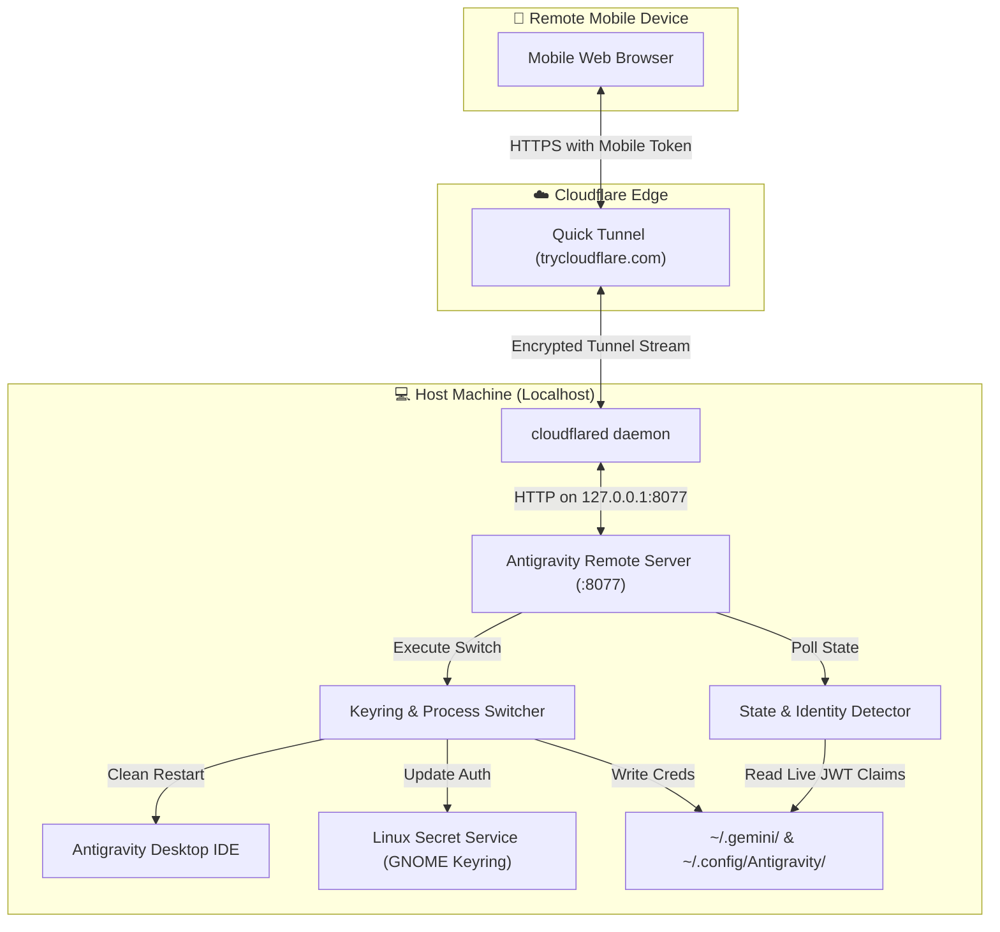

# Technical Architecture & Design

This document details the internal architecture, security boundaries, and credential management mechanisms of **Antigravity Remote**.

---

## 1. Authoritative Identity Detection (Ground Truth)

Many multi-account tools rely on an internal index (such as `accounts.json`) to track which account is currently active. However, if a user logs in, switches, or logs out directly inside the Antigravity IDE or via Google's OAuth web prompt on the desktop, static indexes quickly fall out of sync.

Antigravity Remote implements a multi-tier detection ladder to determine the authoritative live identity:

### Tier 1: Cryptographic JWT Claims
When Antigravity completes a Google OAuth handshake, it persists Google's signed ID token into `~/.gemini/oauth_creds.json`.
- The token is a standard RFC 7519 JSON Web Token (`header.payload.signature`).
- `app/detector.py` decodes the base64url-encoded payload claims without external dependencies.
- It extracts the authoritative `email` and `name` attributes directly signed by Google accounts.

### Tier 2: Google Accounts State
Reads `~/.gemini/google_accounts.json` (`active` field) to cross-verify the active email identifier.

### Tier 3: Secret Service (GNOME Keyring) Lookup
Queries the Linux Secret Service daemon via `secret-tool lookup service gemini username antigravity` to match the currently stored `refresh_token` with configured account profiles.

### Tier 4: Onboarding App Storage Fallback
Reads `~/.config/Antigravity/app_storage.json` (`jetski.onboarding.lastLoginUsername`).

---

## 2. Credential Hot-Swapping Mechanism

Switching accounts without causing Electron crashes or triggering UI popup blockers requires atomic updates across both system keyring storage and file-based state:

1. **Linux Secret Service (GNOME Keyring)**:
   - Antigravity and the `agy` CLI interact with the system keyring using the Freedesktop Secret Service API.
   - `app/switcher.py` directly stores the new OAuth access token, refresh token, and token type into the `'login'` keyring collection.
2. **File-Based Credential Persistence**:
   - Atomically writes `~/.gemini/oauth_creds.json` with strict `0600` permissions.
   - Atomically updates `~/.gemini/google_accounts.json`.
3. **Clean Electron Process Lifecycle**:
   - Scans `/proc` to identify main Antigravity Electron processes (while strictly excluding background daemons like `antigravity-tools`).
   - Sends `SIGTERM` to permit orderly window teardown.
   - Cleans up any stale Chromium/Electron lock files (`~/.config/Antigravity/Singleton*`).
   - Relaunches the Antigravity IDE in the user's active graphical display session (`WAYLAND_DISPLAY` / `DISPLAY`).

---

## 3. Quota Telemetry Aggregation

The raw Antigravity quota payload returns individual metrics for 8+ internal sub-models (e.g., `gemini-pro-high`, `gemini-flash-tiered`, `claude-3-5-sonnet`, `claude-opus`, etc.).

To avoid cognitive overload on mobile screens:
- Quotas are mathematically grouped into the two primary capacity pools: **Gemini** and **Claude**.
- The highest-tier representative model's percentage and reset time are surfaced.
- Tabular numeral formatting (`tabular-nums`) is enforced to eliminate layout jitter during live counter updates.

---

## 4. Zero-Trust Mobile Security Model

1. **Host-Local Binding**: The HTTP server binds exclusively to `127.0.0.1:8077`. It is never directly exposed to the public network or local LAN.
2. **Encrypted Cloudflare Tunnel**:
   - The tunnel negotiates an outbound TLS connection from the host PC to Cloudflare's edge network.
   - No inbound router ports, dynamic DNS, or port forwarding are required.
3. **Multi-Factor Authentication (RFC 6238 TOTP)**:
   - Supports standard Time-Based One-Time Passwords (compatible with Google Authenticator, Microsoft Authenticator, 1Password).
   - Computes HMAC-SHA1 over 30-second intervals with $\pm 1$ time-step clock drift allowance.
   - Pure Python standard library implementation in `app/totp.py` without external pip dependencies.
4. **Device-Bound Ephemeral Session Tokens (Anti-Cookie-Hijacking)**:
   - Instead of storing raw master tokens in cookies, the server issues cryptographically signed session tokens:
     `v1.<epoch>.<device_fingerprint>.<hmac_signature>`
   - `device_fingerprint` hashes client `User-Agent`, `Accept-Language`, and `Sec-Ch-Ua-Platform`.
   - Replay attempts using a stolen session cookie from a different browser or device fail authentication with `HTTP 401 Unauthorized`.
5. **Strict 24-Hour Session Lifetime**:
   - All session cookies enforce `Max-Age=86400` with `HttpOnly; SameSite=Lax`.
   - Server-side epoch validation (`time.time() - epoch > 86400`) ensures expired tokens cannot be reused, requiring periodic re-authentication.
6. **Access Audit Logging (`log/ip.json`)**:
   - Client IPs, Cloudflare geo attributes (`CF-IPCountry`, `CF-Ray`), device types, and authentication outcomes are persistently logged.
   - Built-in 30-day retention filter automatically purges expired records during runtime.
7. **Administrative Terminal Killswitch**:
   - Both the `/terminal` web view and `/api/terminal/ws` WebSocket upgrade endpoints are gated by `terminal_enabled` in `state.json`/`static.json`.
   - When disabled, shell execution is strictly blocked with `HTTP 403 Forbidden`.
